# Mapping: m_comprehensive_poc

**Description:** Comprehensive POC mapping with all transformation types

## Overview

This mapping is auto-generated from Informatica XML export.

## Data Flow

### Sources

### Targets

## Transformation Steps

## Data Lineage

```mermaid
graph LR
    SQ_Customer_Data --> EXP_Customer_Processing
    SQ_Customer_Data --> EXP_Customer_Processing
    SQ_Customer_Data --> EXP_Customer_Processing
    SQ_Customer_Data --> EXP_Customer_Processing
    SQ_Customer_Data --> EXP_Customer_Processing
    SQ_Customer_Data --> EXP_Customer_Processing
    SQ_Customer_Data --> EXP_Customer_Processing
    SQ_Customer_Data --> EXP_Customer_Processing
    SQ_Customer_Data --> EXP_Customer_Processing
    SQ_Customer_Data --> EXP_Customer_Processing
    EXP_Customer_Processing --> FLT_Active_Customers
    EXP_Customer_Processing --> FLT_Active_Customers
    EXP_Customer_Processing --> FLT_Active_Customers
    EXP_Customer_Processing --> FLT_Active_Customers
    EXP_Customer_Processing --> FLT_Active_Customers
    EXP_Customer_Processing --> FLT_Active_Customers
    EXP_Customer_Processing --> FLT_Active_Customers
    EXP_Customer_Processing --> FLT_Active_Customers
    EXP_Customer_Processing --> FLT_Active_Customers
    EXP_Customer_Processing --> FLT_Active_Customers
    FLT_Active_Customers --> AGG_Customer_Summary
    FLT_Active_Customers --> AGG_Customer_Summary
    FLT_Active_Customers --> AGG_Customer_Summary
    FLT_Active_Customers --> AGG_Customer_Summary
    FLT_Active_Customers --> AGG_Customer_Summary
    FLT_Active_Customers --> AGG_Customer_Summary
    FLT_Active_Customers --> LKP_Customer_Status
    FLT_Active_Customers --> LKP_Customer_Status
    FLT_Active_Customers --> JNR_Customer_Orders
    FLT_Active_Customers --> JNR_Customer_Orders
    FLT_Active_Customers --> RTR_Customer_Segments
    FLT_Active_Customers --> RTR_Customer_Segments
    FLT_Active_Customers --> RTR_Customer_Segments
    FLT_Active_Customers --> RTR_Customer_Segments
    RTR_Customer_Segments --> SEQ_Customer_ID
    RTR_Customer_Segments --> SEQ_Customer_ID
    RTR_Customer_Segments --> SEQ_Customer_ID
    RTR_Customer_Segments --> SEQ_Customer_ID
    SEQ_Customer_ID --> UPDSTRAT_Customer_Update
    SEQ_Customer_ID --> UPDSTRAT_Customer_Update
    SEQ_Customer_ID --> UPDSTRAT_Customer_Update
    SEQ_Customer_ID --> UPDSTRAT_Customer_Update
    SEQ_Customer_ID --> UPDSTRAT_Customer_Update
    UPDSTRAT_Customer_Update --> T_Customer_Output
    UPDSTRAT_Customer_Update --> T_Customer_Output
    UPDSTRAT_Customer_Update --> T_Customer_Output
    UPDSTRAT_Customer_Update --> T_Customer_Output
    UPDSTRAT_Customer_Update --> T_Customer_Output
    AGG_Customer_Summary --> T_Customer_Summary
    AGG_Customer_Summary --> T_Customer_Summary
    AGG_Customer_Summary --> T_Customer_Summary
    AGG_Customer_Summary --> T_Customer_Summary
    RTR_Customer_Segments --> T_Customer_Premium
    RTR_Customer_Segments --> RTR_Customer_Segments
    RTR_Customer_Segments --> T_Customer_Premium
    RTR_Customer_Segments --> T_Customer_Standard
    RTR_Customer_Segments --> T_Customer_Standard
    RTR_Customer_Segments --> T_Customer_Standard
```

