# Mapping: m_comprehensive_poc

**Description:** Comprehensive POC mapping with all transformation types

## Overview

This mapping is auto-generated from Informatica XML export.

## Data Flow

### Sources

### Targets

## Transformation Steps

### Step 1: SQ_Customer_Data
**Type:** Source Qualifier
**Description:** Source Qualifier for customer data

### Step 2: EXP_Customer_Processing
**Type:** Expression
**Description:** Process customer data with expressions
**Inputs:** CUSTOMER_ID, FIRST_NAME, LAST_NAME, EMAIL, PHONE, REGISTRATION_DATE, ACCOUNT_BALANCE, STATUS, CITY, COUNTRY
**Outputs:** CUSTOMER_ID, FULL_NAME, EMAIL, CLEAN_PHONE, REGISTRATION_DATE, ACCOUNT_BALANCE, STATUS, CUSTOMER_SEGMENT, CITY, COUNTRY
**Expressions:**
- FULL_NAME: `CONCAT(CONCAT(FIRST_NAME, ' '), LAST_NAME)`
- CLEAN_PHONE: `IIF(ISNULL(PHONE), 'N/A', REGEX_REPLACE(PHONE, '[^0-9]', ''))`
- CUSTOMER_SEGMENT: `IIF(ACCOUNT_BALANCE > 50000, 'PREMIUM', IIF(ACCOUNT_BALANCE > 10000, 'GOLD', 'STANDARD'))`

### Step 3: FLT_Active_Customers
**Type:** Filter
**Description:** Filter active customers only
**Filter:** `STATUS = 'ACTIVE' AND ISNULL(CUSTOMER_ID) = 0`

### Step 4: AGG_Customer_Summary
**Type:** Aggregator
**Description:** Aggregate customer data by location
**Outputs:** TOTAL_BALANCE, CUSTOMER_COUNT
**Expressions:**
- TOTAL_BALANCE: `SUM(ACCOUNT_BALANCE)`
- CUSTOMER_COUNT: `COUNT(CUSTOMER_ID)`

### Step 5: LKP_Customer_Status
**Type:** Lookup Procedure
**Description:** Lookup customer status details
**Inputs:** CUSTOMER_ID, STATUS, LKP_CUSTOMER_ID, LKP_STATUS_DESC
**Outputs:** LKP_CUSTOMER_ID, LKP_STATUS_DESC

### Step 6: JNR_Customer_Orders
**Type:** Joiner
**Description:** Join customer with order data

### Step 7: RTR_Customer_Segments
**Type:** Router
**Description:** Route customers by segment

### Step 8: SEQ_Customer_ID
**Type:** Sequence
**Description:** Generate surrogate keys
**Outputs:** SURROGATE_KEY

### Step 9: UPDSTRAT_Customer_Update
**Type:** Update Strategy
**Description:** Define update strategy

## Data Lineage

```mermaid
graph LR
    SQ_Customer_Data["SQ_Customer_Data<br/>(Source Qualifier)"]
    EXP_Customer_Processing["EXP_Customer_Processing<br/>(Expression)"]
    FLT_Active_Customers["FLT_Active_Customers<br/>(Filter)"]
    AGG_Customer_Summary["AGG_Customer_Summary<br/>(Aggregator)"]
    LKP_Customer_Status["LKP_Customer_Status<br/>(Lookup Procedure)"]
    JNR_Customer_Orders["JNR_Customer_Orders<br/>(Joiner)"]
    RTR_Customer_Segments["RTR_Customer_Segments<br/>(Router)"]
    SEQ_Customer_ID["SEQ_Customer_ID<br/>(Sequence)"]
    UPDSTRAT_Customer_Update["UPDSTRAT_Customer_Update<br/>(Update Strategy)"]
    SQ_Customer_Data --> EXP_Customer_Processing
    SQ_Customer_Data --> EXP_Customer_Processing
    SQ_Customer_Data --> EXP_Customer_Processing
    SQ_Customer_Data --> EXP_Customer_Processing
    SQ_Customer_Data --> EXP_Customer_Processing
    SQ_Customer_Data --> EXP_Customer_Processing
    SQ_Customer_Data --> EXP_Customer_Processing
    SQ_Customer_Data --> EXP_Customer_Processing
    SQ_Customer_Data --> EXP_Customer_Processing
    SQ_Customer_Data --> EXP_Customer_Processing
    EXP_Customer_Processing --> FLT_Active_Customers
    EXP_Customer_Processing --> FLT_Active_Customers
    EXP_Customer_Processing --> FLT_Active_Customers
    EXP_Customer_Processing --> FLT_Active_Customers
    EXP_Customer_Processing --> FLT_Active_Customers
    EXP_Customer_Processing --> FLT_Active_Customers
    EXP_Customer_Processing --> FLT_Active_Customers
    EXP_Customer_Processing --> FLT_Active_Customers
    EXP_Customer_Processing --> FLT_Active_Customers
    EXP_Customer_Processing --> FLT_Active_Customers
    FLT_Active_Customers --> AGG_Customer_Summary
    FLT_Active_Customers --> AGG_Customer_Summary
    FLT_Active_Customers --> AGG_Customer_Summary
    FLT_Active_Customers --> AGG_Customer_Summary
    FLT_Active_Customers --> AGG_Customer_Summary
    FLT_Active_Customers --> AGG_Customer_Summary
    FLT_Active_Customers --> LKP_Customer_Status
    FLT_Active_Customers --> LKP_Customer_Status
    FLT_Active_Customers --> JNR_Customer_Orders
    FLT_Active_Customers --> JNR_Customer_Orders
    FLT_Active_Customers --> RTR_Customer_Segments
    FLT_Active_Customers --> RTR_Customer_Segments
    FLT_Active_Customers --> RTR_Customer_Segments
    FLT_Active_Customers --> RTR_Customer_Segments
    RTR_Customer_Segments --> SEQ_Customer_ID
    RTR_Customer_Segments --> SEQ_Customer_ID
    RTR_Customer_Segments --> SEQ_Customer_ID
    RTR_Customer_Segments --> SEQ_Customer_ID
    SEQ_Customer_ID --> UPDSTRAT_Customer_Update
    SEQ_Customer_ID --> UPDSTRAT_Customer_Update
    SEQ_Customer_ID --> UPDSTRAT_Customer_Update
    SEQ_Customer_ID --> UPDSTRAT_Customer_Update
    SEQ_Customer_ID --> UPDSTRAT_Customer_Update
    UPDSTRAT_Customer_Update --> T_Customer_Output
    UPDSTRAT_Customer_Update --> T_Customer_Output
    UPDSTRAT_Customer_Update --> T_Customer_Output
    UPDSTRAT_Customer_Update --> T_Customer_Output
    UPDSTRAT_Customer_Update --> T_Customer_Output
    AGG_Customer_Summary --> T_Customer_Summary
    AGG_Customer_Summary --> T_Customer_Summary
    AGG_Customer_Summary --> T_Customer_Summary
    AGG_Customer_Summary --> T_Customer_Summary
    RTR_Customer_Segments --> T_Customer_Premium
    RTR_Customer_Segments --> RTR_Customer_Segments
    RTR_Customer_Segments --> T_Customer_Premium
    RTR_Customer_Segments --> T_Customer_Standard
    RTR_Customer_Segments --> T_Customer_Standard
    RTR_Customer_Segments --> T_Customer_Standard
```

