# Mapping: m_COMPTIME_Build_Message_Counters

**Description:** This mapping gets the count of detail records on the CompTime file that was processed and loads it to the Counters Table. 

## Overview

This mapping is auto-generated from Informatica XML export.

## Data Flow

### Sources

- **U0287D01**
  - Fields:
    - SSN (string)
    - NAME (string)
    - CURRENT_ACCT (string)
    - CURRENT_ORG (string)
    - FLSA_STATUS (string)
    - COMP_TIME_CUR_BAL (number)
    - COMP_TIME_YEAR_EARNED (number)
    - PP_END_DATE (string)
    - DAILY_DATE_EARNED (string)
    - COMP_TIME_RATE (number)
    - COMP_TIME_HOURS (number)
    - COMP_TIME_UNDEF (number)

### Targets

- **COUNTER_TBL**
  - Fields:
    - RUN_DATE (date)
    - PROCESS_NAME (varchar2)
    - COUNTER_DESCRIPTION (varchar2)
    - COUNTER_VALUE (number)
    - PP_END_YEAR (number(p,s))
    - PP_NUM (number(p,s))
    - CYCLE_ID (number(p,s))

- **COMPTIME_MESSAGE_FILE**
  - Fields:
    - SUBJECT (string)
    - MESSAGE (string)

## Transformation Steps

### Step 1: SQ_U0287D01
**Type:** Source Qualifier
**Inputs:** SSN, NAME, CURRENT_ACCT, CURRENT_ORG, FLSA_STATUS, COMP_TIME_CUR_BAL, COMP_TIME_YEAR_EARNED, PP_END_DATE, DAILY_DATE_EARNED, COMP_TIME_RATE, COMP_TIME_HOURS, COMP_TIME_UNDEF
**Outputs:** SSN, NAME, CURRENT_ACCT, CURRENT_ORG, FLSA_STATUS, COMP_TIME_CUR_BAL, COMP_TIME_YEAR_EARNED, PP_END_DATE, DAILY_DATE_EARNED, COMP_TIME_RATE, COMP_TIME_HOURS, COMP_TIME_UNDEF

### Step 2: exp_Initial
**Type:** Expression
**Description:** Determines Detail records to be used for further processing.
**Inputs:** SSN, NAME
**Outputs:** SSN, NAME, o_RECORD_TYPE_FLAG
**Expressions:**
- SSN: `SSN`
- NAME: `NAME`
- o_RECORD_TYPE_FLAG: `DECODE(TRUE,
			   IS_NUMBER(SSN), 'D',
			  'NO')`

### Step 3: fil_Detail
**Type:** Filter
**Description:** Filters Detail Records
**Inputs:** SSN, RECORD_TYPE_FLAG, RECORD_TYPE, DETAIL_CONSTANT
**Outputs:** SSN, RECORD_TYPE_FLAG, RECORD_TYPE, DETAIL_CONSTANT
**Filter:** `RECORD_TYPE_FLAG = 'D'

--RECORD_TYPE_FLAG = 'H' OR`

### Step 4: agg_ALL_RECORDS
**Type:** Aggregator
**Description:** Performs a count on all Detail Records.
**Inputs:** SSN, RECORD_TYPE_FLAG, RECORD_TYPE
**Outputs:** SSN, RECORD_TYPE_FLAG, RECORD_TYPE, o_DETAIL_RECORD_COUNT
**Expressions:**
- SSN: `SSN`
- RECORD_TYPE_FLAG: `RECORD_TYPE_FLAG`
- RECORD_TYPE: `RECORD_TYPE`
- o_DETAIL_RECORD_COUNT: `COUNT(SSN)`

### Step 5: exp_Detail_Count
**Type:** Expression
**Inputs:** DETAIL_RECORD_COUNT
**Outputs:** DETAIL_RECORD_COUNT, o_CURR_PP_FLAG
**Expressions:**
- DETAIL_RECORD_COUNT: `DETAIL_RECORD_COUNT`
- o_CURR_PP_FLAG: `'Y'`

### Step 6: lkp_PAY_PERIOD
**Type:** Lookup Procedure
**Inputs:** in_CURR_PP_FLAG, PP_NUM, PP_END_YEAR, PP_START_DTE, PP_END_DTE, LV_NUM, LV_YEAR, PAY_DTE, CURR_PP_FLAG
**Outputs:** PP_NUM, PP_END_YEAR, PP_START_DTE, PP_END_DTE, LV_NUM, LV_YEAR, PAY_DTE, CURR_PP_FLAG

### Step 7: exp_Counters
**Type:** Expression
**Description:** Compiles all the counter values.
**Inputs:** DETAIL_RECORD_COUNT, lkp_PP_NUM, lkp_PP_END_YEAR
**Outputs:** o_COUNTER_DESCRIPTION_1, DETAIL_RECORD_COUNT, lkp_PP_NUM, lkp_PP_END_YEAR
**Expressions:**
- o_COUNTER_DESCRIPTION_1: `'Number of detail records from the COMP TIME file.'`
- DETAIL_RECORD_COUNT: `DETAIL_RECORD_COUNT`
- lkp_PP_NUM: `lkp_PP_NUM`
- lkp_PP_END_YEAR: `lkp_PP_END_YEAR`

### Step 8: exp_Final
**Type:** Expression
**Inputs:** COUNTER_DESCRIPTION, COUNTER_VALUE
**Outputs:** o_RUN_DATE, o_PROCESS_NAME, COUNTER_DESCRIPTION, COUNTER_VALUE
**Expressions:**
- o_RUN_DATE: `SESSSTARTTIME`
- o_PROCESS_NAME: `$PMMappingName`
- COUNTER_DESCRIPTION: `COUNTER_DESCRIPTION`
- COUNTER_VALUE: `COUNTER_VALUE`

### Step 9: exp_Build_Message
**Type:** Expression
**Description:** This transformation sets the mapping variables MAP_SUBJECT and MAP_MESSAGE using the counters and descriptions set in the previous expression transformation.
**Inputs:** COUNTER_DESCRIPTION_1, COUNTER_1, PP_NUM, PP_END_YEAR
**Outputs:** o_SUBJECT, o_MESSAGE
**Expressions:**
- v_PP_NUM: `IIF(PP_NUM < 10,
       LPAD(TO_CHAR(PP_NUM), 2, '0'),
    TO_CHAR(PP_NUM)
)`
- v_ENVIRONMENT: `DECODE(SUBSTR($PMRepositoryServiceName, 1, 4),
                       'Dev_', 'Dev: ',
                       'Test',   'Test: ',
                       'Prod',  'Prod: ')
`
- v_SUBJECT: `v_ENVIRONMENT ||
'Comp Time File loaded successfully for Pay Period:  ' || 
TO_CHAR(PP_END_YEAR) || '-' || v_PP_NUM`
- o_SUBJECT: `SETVARIABLE($$MAP_SUBJECT, v_SUBJECT)`
- v_MESSAGE: `'Number of Detail Records from Comp Time file	= ' || TO_CHAR(COUNTER_1)`
- o_MESSAGE: `SETVARIABLE($$MAP_MESSAGE, v_MESSAGE)`

### Step 10: exp_Final_Message
**Type:** Expression
**Inputs:** SUBJECT, MESSAGE
**Outputs:** SUBJECT, MESSAGE
**Expressions:**
- SUBJECT: `SUBJECT`
- MESSAGE: `MESSAGE`

## Data Lineage

```mermaid
graph LR
    U0287D01["Source: U0287D01"]
    exp_Build_Message["exp_Build_Message<br/>(Expression)"]
    fil_Detail["fil_Detail<br/>(Filter)"]
    exp_Initial["exp_Initial<br/>(Expression)"]
    agg_ALL_RECORDS["agg_ALL_RECORDS<br/>(Aggregator)"]
    exp_Detail_Count["exp_Detail_Count<br/>(Expression)"]
    exp_Counters["exp_Counters<br/>(Expression)"]
    exp_Final["exp_Final<br/>(Expression)"]
    SQ_U0287D01["SQ_U0287D01<br/>(Source Qualifier)"]
    lkp_PAY_PERIOD["lkp_PAY_PERIOD<br/>(Lookup Procedure)"]
    exp_Final_Message["exp_Final_Message<br/>(Expression)"]
    COUNTER_TBL["Target: COUNTER_TBL"]
    COMPTIME_MESSAGE_FILE["Target: COMPTIME_MESSAGE_FILE"]
    exp_Final --> COUNTER_TBL
    exp_Final --> COUNTER_TBL
    exp_Final --> COUNTER_TBL
    exp_Final --> COUNTER_TBL
    exp_Final_Message --> COMPTIME_MESSAGE_FILE
    exp_Final_Message --> COMPTIME_MESSAGE_FILE
    exp_Build_Message --> exp_Final_Message
    exp_Build_Message --> exp_Final_Message
    exp_Counters --> exp_Build_Message
    exp_Counters --> exp_Build_Message
    exp_Counters --> exp_Build_Message
    exp_Counters --> exp_Build_Message
    exp_Initial --> fil_Detail
    exp_Initial --> fil_Detail
    fil_Detail --> agg_ALL_RECORDS
    fil_Detail --> agg_ALL_RECORDS
    fil_Detail --> agg_ALL_RECORDS
    SQ_U0287D01 --> exp_Initial
    SQ_U0287D01 --> exp_Initial
    agg_ALL_RECORDS --> exp_Detail_Count
    exp_Detail_Count --> exp_Counters
    exp_Detail_Count --> lkp_PAY_PERIOD
    lkp_PAY_PERIOD --> exp_Counters
    lkp_PAY_PERIOD --> exp_Counters
    exp_Counters --> exp_Final
    exp_Counters --> exp_Final
    U0287D01 --> SQ_U0287D01
    U0287D01 --> SQ_U0287D01
    U0287D01 --> SQ_U0287D01
    U0287D01 --> SQ_U0287D01
    U0287D01 --> SQ_U0287D01
    U0287D01 --> SQ_U0287D01
    U0287D01 --> SQ_U0287D01
    U0287D01 --> SQ_U0287D01
    U0287D01 --> SQ_U0287D01
    U0287D01 --> SQ_U0287D01
    U0287D01 --> SQ_U0287D01
    U0287D01 --> SQ_U0287D01
```

