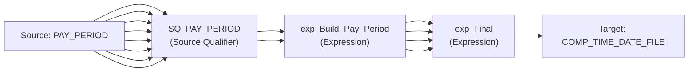

# Mapping: m_COMPTIME_Current_Pay_Period

**Description:** This mapping returns the Current Pay Period from the Pay Period table.

## Overview

This mapping is auto-generated from Informatica XML export.

## Data Flow

### Sources

- **PAY_PERIOD**
  - Fields:
    - PP_NUM (number(p,s))
    - PP_END_YEAR (number(p,s))
    - PP_START_DTE (date)
    - PP_END_DTE (date)
    - LV_NUM (number(p,s))
    - LV_YEAR (number(p,s))
    - PAY_DTE (date)
    - CURR_PP_FLAG (varchar2)
    - HOLIDAY_1 (date)
    - HOLIDAY_2 (date)

### Targets

- **COMP_TIME_DATE_FILE**
  - Fields:
    - PAY_PERIOD (string)

## Transformation Steps

### Step 1: SQ_PAY_PERIOD
**Type:** Source Qualifier
**Inputs:** PP_NUM, PP_END_YEAR, PP_START_DTE, PP_END_DTE, LV_NUM, LV_YEAR, PAY_DTE, CURR_PP_FLAG
**Outputs:** PP_NUM, PP_END_YEAR, PP_START_DTE, PP_END_DTE, LV_NUM, LV_YEAR, PAY_DTE, CURR_PP_FLAG

### Step 2: exp_Build_Pay_Period
**Type:** Expression
**Description:** This transformation combines the Current Pay Period and Current year into one string.
**Inputs:** PP_NUM, PP_END_YEAR
**Outputs:** o_PAY_PERIOD, o_MAP_PP_YEAR_NUM, o_PP_END_YEAR, o_PP_NUM
**Expressions:**
- v_PP_NUM: `IIF(PP_NUM < 10,
       LPAD(TO_CHAR(PP_NUM), 2, '0'),
    TO_CHAR(PP_NUM)
)`
- o_PAY_PERIOD: `TO_CHAR(PP_END_YEAR) || v_PP_NUM`
- v_PAY_PERIOD: `TO_CHAR(PP_END_YEAR) || v_PP_NUM`
- o_MAP_PP_YEAR_NUM: `SETVARIABLE($$MAP_PP_YEAR_NUM, v_PAY_PERIOD)`
- o_PP_END_YEAR: `SETVARIABLE($$MAP_PP_END_YEAR, PP_END_YEAR)`
- o_PP_NUM: `SETVARIABLE($$MAP_PP_NUM, PP_NUM)`

### Step 3: exp_Final
**Type:** Expression
**Inputs:** PAY_PERIOD, MAP_PP_YEAR_NUM, PP_END_YEAR, PP_NUM
**Outputs:** PAY_PERIOD
**Expressions:**
- PAY_PERIOD: `PAY_PERIOD`

## Data Lineage

