# Mapping: m_COMPTIME_Load_COMP_TIME_DAILY_TBL

**Description:** 

## Overview

This mapping is auto-generated from Informatica XML export.

## Data Flow

### Sources

- **U0287D01**
  - Fields:
    - SSN (string)
    - NAME (string)
    - CURRENT_ACCT (string)
    - CURRENT_ORG (string)
    - FLSA_STATUS (string)
    - COMP_TIME_CUR_BAL (number)
    - COMP_TIME_YEAR_EARNED (number)
    - PP_END_DATE (string)
    - DAILY_DATE_EARNED (string)
    - COMP_TIME_RATE (number)
    - COMP_TIME_HOURS (number)
    - COMP_TIME_UNDEF (number)

### Targets

- **COMP_TIME_DAILY_TBL**
  - Fields:
    - PP_END_YEAR (number(p,s))
    - PP_NUM (number(p,s))
    - PP_YEAR_NUM (number(p,s))
    - SSN (varchar2)
    - NAME (varchar2)
    - CURRENT_ACCT (varchar2)
    - CURRENT_ORG (varchar2)
    - FLSA_STATUS (varchar2)
    - COMP_TIME_CUR_BAL (number(p,s))
    - COMP_TIME_YEAR_EARNED (number(p,s))
    - PP_END_DATE (date)
    - DAILY_DATE_EARNED (date)
    - COMP_TIME_RATE (number(p,s))
    - COMP_TIME_HOURS (number(p,s))
    - COMP_TIME_UNDEF (number(p,s))

## Transformation Steps

### Step 1: SQ_U0287D01
**Type:** Source Qualifier
**Inputs:** SSN, NAME, CURRENT_ACCT, CURRENT_ORG, FLSA_STATUS, COMP_TIME_CUR_BAL, COMP_TIME_YEAR_EARNED, PP_END_DATE, DAILY_DATE_EARNED, COMP_TIME_RATE, COMP_TIME_HOURS, COMP_TIME_UNDEF
**Outputs:** SSN, NAME, CURRENT_ACCT, CURRENT_ORG, FLSA_STATUS, COMP_TIME_CUR_BAL, COMP_TIME_YEAR_EARNED, PP_END_DATE, DAILY_DATE_EARNED, COMP_TIME_RATE, COMP_TIME_HOURS, COMP_TIME_UNDEF

### Step 2: exp_Initial
**Type:** Expression
**Inputs:** SSN, NAME, CURRENT_ACCT, CURRENT_ORG, FLSA_STATUS, COMP_TIME_CUR_BAL, COMP_TIME_YEAR_EARNED, PP_END_DATE, DAILY_DATE_EARNED, COMP_TIME_RATE, COMP_TIME_HOURS, COMP_TIME_UNDEF
**Outputs:** SSN, NAME, CURRENT_ACCT, CURRENT_ORG, FLSA_STATUS, COMP_TIME_CUR_BAL, COMP_TIME_YEAR_EARNED, PP_END_DATE, DAILY_DATE_EARNED, COMP_TIME_RATE, COMP_TIME_HOURS, COMP_TIME_UNDEF, o_CURR_PP_FLAG, o_VALID_RECORD_FLAG
**Expressions:**
- SSN: `SSN`
- NAME: `NAME`
- CURRENT_ACCT: `CURRENT_ACCT`
- CURRENT_ORG: `CURRENT_ORG`
- FLSA_STATUS: `FLSA_STATUS`
- COMP_TIME_CUR_BAL: `COMP_TIME_CUR_BAL`
- COMP_TIME_YEAR_EARNED: `COMP_TIME_YEAR_EARNED`
- PP_END_DATE: `PP_END_DATE`
- DAILY_DATE_EARNED: `DAILY_DATE_EARNED`
- COMP_TIME_RATE: `COMP_TIME_RATE`
- COMP_TIME_HOURS: `COMP_TIME_HOURS`
- COMP_TIME_UNDEF: `COMP_TIME_UNDEF`
- o_CURR_PP_FLAG: `'Y'`
- o_VALID_RECORD_FLAG: `DECODE (TRUE, IS_NUMBER(SSN), 1,
                                    0)
                       `

### Step 3: fil_Valid_Records
**Type:** Filter
**Inputs:** SSN, NAME, CURRENT_ACCT, CURRENT_ORG, FLSA_STATUS, COMP_TIME_CUR_BAL, COMP_TIME_YEAR_EARNED, PP_END_DATE, DAILY_DATE_EARNED, COMP_TIME_RATE, COMP_TIME_HOURS, COMP_TIME_UNDEF, CURR_PP_FLAG, VALID_RECORD_FLAG
**Outputs:** SSN, NAME, CURRENT_ACCT, CURRENT_ORG, FLSA_STATUS, COMP_TIME_CUR_BAL, COMP_TIME_YEAR_EARNED, PP_END_DATE, DAILY_DATE_EARNED, COMP_TIME_RATE, COMP_TIME_HOURS, COMP_TIME_UNDEF, CURR_PP_FLAG, VALID_RECORD_FLAG
**Filter:** `VALID_RECORD_FLAG = TRUE`

### Step 4: lkp_PAY_PERIOD
**Type:** Lookup Procedure
**Inputs:** in_CURR_PP_FLAG, PP_NUM, PP_END_YEAR, PP_START_DTE, PP_END_DTE, LV_NUM, LV_YEAR, PAY_DTE, CURR_PP_FLAG
**Outputs:** PP_NUM, PP_END_YEAR, PP_START_DTE, PP_END_DTE, LV_NUM, LV_YEAR, PAY_DTE, CURR_PP_FLAG

### Step 5: exp_Convert
**Type:** Expression
**Inputs:** SSN, NAME, CURRENT_ACCT, CURRENT_ORG, FLSA_STATUS, COMP_TIME_CUR_BAL, COMP_TIME_YEAR_EARNED, PP_END_DATE, DAILY_DATE_EARNED, COMP_TIME_RATE, COMP_TIME_HOURS, COMP_TIME_UNDEF, lkp_PP_NUM, lkp_PP_END_YEAR
**Outputs:** SSN, NAME, CURRENT_ACCT, CURRENT_ORG, FLSA_STATUS, COMP_TIME_CUR_BAL, COMP_TIME_YEAR_EARNED, o_PP_END_DATE, o_DAILY_DATE_EARNED, COMP_TIME_RATE, COMP_TIME_HOURS, COMP_TIME_UNDEF, o_PP_END_YEAR, o_PP_NUM, o_PP_YEAR_NUM
**Expressions:**
- SSN: `SSN`
- NAME: `NAME`
- CURRENT_ACCT: `CURRENT_ACCT`
- CURRENT_ORG: `CURRENT_ORG`
- FLSA_STATUS: `FLSA_STATUS`
- COMP_TIME_CUR_BAL: `COMP_TIME_CUR_BAL`
- COMP_TIME_YEAR_EARNED: `COMP_TIME_YEAR_EARNED`
- o_PP_END_DATE: `IIF(IS_DATE(PP_END_DATE, 'YYYYMMDD'),
                                   TO_DATE(PP_END_DATE, 'YYYYMMDD')
       )`
- o_DAILY_DATE_EARNED: `IIF(IS_DATE(DAILY_DATE_EARNED, 'YYYYMMDD'),
                                   TO_DATE(DAILY_DATE_EARNED, 'YYYYMMDD')
       )`
- COMP_TIME_RATE: `COMP_TIME_RATE`
- COMP_TIME_HOURS: `COMP_TIME_HOURS`
- COMP_TIME_UNDEF: `COMP_TIME_UNDEF`
- o_PP_END_YEAR: `lkp_PP_END_YEAR
`
- o_PP_NUM: `lkp_PP_NUM
`
- o_PP_YEAR_NUM: `TO_DECIMAL(
TO_CHAR(lkp_PP_END_YEAR) || 
LPAD(TO_CHAR(lkp_PP_NUM), 2, '0'))
`

### Step 6: exp_Final
**Type:** Expression
**Inputs:** PP_END_YEAR, PP_NUM, PP_YEAR_NUM, SSN, NAME, CURRENT_ACCT, CURRENT_ORG, FLSA_STATUS, COMP_TIME_CUR_BAL, COMP_TIME_YEAR_EARNED, PP_END_DATE, DAILY_DATE_EARNED, COMP_TIME_RATE, COMP_TIME_HOURS, COMP_TIME_UNDEF
**Outputs:** PP_END_YEAR, PP_NUM, PP_YEAR_NUM, SSN, NAME, CURRENT_ACCT, CURRENT_ORG, FLSA_STATUS, COMP_TIME_CUR_BAL, COMP_TIME_YEAR_EARNED, PP_END_DATE, DAILY_DATE_EARNED, COMP_TIME_RATE, COMP_TIME_HOURS, COMP_TIME_UNDEF
**Expressions:**
- PP_END_YEAR: `PP_END_YEAR`
- PP_NUM: `PP_NUM`
- PP_YEAR_NUM: `PP_YEAR_NUM`
- SSN: `SSN`
- NAME: `NAME`
- CURRENT_ACCT: `CURRENT_ACCT`
- CURRENT_ORG: `CURRENT_ORG`
- FLSA_STATUS: `FLSA_STATUS`
- COMP_TIME_CUR_BAL: `COMP_TIME_CUR_BAL`
- COMP_TIME_YEAR_EARNED: `COMP_TIME_YEAR_EARNED`
- PP_END_DATE: `PP_END_DATE`
- DAILY_DATE_EARNED: `DAILY_DATE_EARNED`
- COMP_TIME_RATE: `COMP_TIME_RATE`
- COMP_TIME_HOURS: `COMP_TIME_HOURS`
- COMP_TIME_UNDEF: `COMP_TIME_UNDEF`

## Data Lineage

```mermaid
graph LR
    U0287D01["Source: U0287D01"]
    SQ_U0287D01["SQ_U0287D01<br/>(Source Qualifier)"]
    exp_Initial["exp_Initial<br/>(Expression)"]
    exp_Final["exp_Final<br/>(Expression)"]
    lkp_PAY_PERIOD["lkp_PAY_PERIOD<br/>(Lookup Procedure)"]
    exp_Convert["exp_Convert<br/>(Expression)"]
    fil_Valid_Records["fil_Valid_Records<br/>(Filter)"]
    COMP_TIME_DAILY_TBL["Target: COMP_TIME_DAILY_TBL"]
    exp_Final --> COMP_TIME_DAILY_TBL
    exp_Final --> COMP_TIME_DAILY_TBL
    exp_Final --> COMP_TIME_DAILY_TBL
    exp_Final --> COMP_TIME_DAILY_TBL
    exp_Final --> COMP_TIME_DAILY_TBL
    exp_Final --> COMP_TIME_DAILY_TBL
    exp_Final --> COMP_TIME_DAILY_TBL
    exp_Final --> COMP_TIME_DAILY_TBL
    exp_Final --> COMP_TIME_DAILY_TBL
    exp_Final --> COMP_TIME_DAILY_TBL
    exp_Final --> COMP_TIME_DAILY_TBL
    exp_Final --> COMP_TIME_DAILY_TBL
    exp_Final --> COMP_TIME_DAILY_TBL
    exp_Final --> COMP_TIME_DAILY_TBL
    exp_Final --> COMP_TIME_DAILY_TBL
    U0287D01 --> SQ_U0287D01
    U0287D01 --> SQ_U0287D01
    U0287D01 --> SQ_U0287D01
    U0287D01 --> SQ_U0287D01
    U0287D01 --> SQ_U0287D01
    U0287D01 --> SQ_U0287D01
    U0287D01 --> SQ_U0287D01
    U0287D01 --> SQ_U0287D01
    U0287D01 --> SQ_U0287D01
    U0287D01 --> SQ_U0287D01
    U0287D01 --> SQ_U0287D01
    U0287D01 --> SQ_U0287D01
    SQ_U0287D01 --> exp_Initial
    SQ_U0287D01 --> exp_Initial
    SQ_U0287D01 --> exp_Initial
    SQ_U0287D01 --> exp_Initial
    SQ_U0287D01 --> exp_Initial
    SQ_U0287D01 --> exp_Initial
    SQ_U0287D01 --> exp_Initial
    SQ_U0287D01 --> exp_Initial
    SQ_U0287D01 --> exp_Initial
    SQ_U0287D01 --> exp_Initial
    SQ_U0287D01 --> exp_Initial
    SQ_U0287D01 --> exp_Initial
    exp_Initial --> fil_Valid_Records
    exp_Initial --> fil_Valid_Records
    exp_Initial --> fil_Valid_Records
    exp_Initial --> fil_Valid_Records
    exp_Initial --> fil_Valid_Records
    exp_Initial --> fil_Valid_Records
    exp_Initial --> fil_Valid_Records
    exp_Initial --> fil_Valid_Records
    exp_Initial --> fil_Valid_Records
    exp_Initial --> fil_Valid_Records
    exp_Initial --> fil_Valid_Records
    exp_Initial --> fil_Valid_Records
    exp_Initial --> fil_Valid_Records
    exp_Initial --> fil_Valid_Records
    exp_Convert --> exp_Final
    exp_Convert --> exp_Final
    exp_Convert --> exp_Final
    exp_Convert --> exp_Final
    exp_Convert --> exp_Final
    exp_Convert --> exp_Final
    exp_Convert --> exp_Final
    exp_Convert --> exp_Final
    exp_Convert --> exp_Final
    exp_Convert --> exp_Final
    exp_Convert --> exp_Final
    exp_Convert --> exp_Final
    exp_Convert --> exp_Final
    exp_Convert --> exp_Final
    exp_Convert --> exp_Final
    fil_Valid_Records --> lkp_PAY_PERIOD
    lkp_PAY_PERIOD --> exp_Convert
    lkp_PAY_PERIOD --> exp_Convert
    fil_Valid_Records --> exp_Convert
    fil_Valid_Records --> exp_Convert
    fil_Valid_Records --> exp_Convert
    fil_Valid_Records --> exp_Convert
    fil_Valid_Records --> exp_Convert
    fil_Valid_Records --> exp_Convert
    fil_Valid_Records --> exp_Convert
    fil_Valid_Records --> exp_Convert
    fil_Valid_Records --> exp_Convert
    fil_Valid_Records --> exp_Convert
    fil_Valid_Records --> exp_Convert
    fil_Valid_Records --> exp_Convert
```

