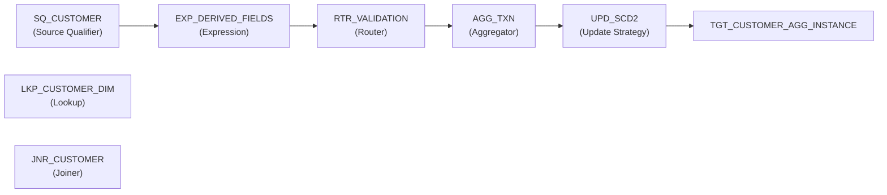

# Mapping: M_BFSI_CUSTOMER_360

**Description:** 

## Overview

This mapping is auto-generated from Informatica XML export.

## Data Flow

### Sources

### Targets

## Transformation Steps

### Step 1: SQ_CUSTOMER
**Type:** Source Qualifier

### Step 2: EXP_DERIVED_FIELDS
**Type:** Expression
**Expressions:**
- TXN_FLAG: `IIF(TXN_AMOUNT > 100000, 'HIGH', 'NORMAL')`
- VALID_TXN: `IIF(ISNULL(TXN_AMOUNT), 0, 1)`

### Step 3: LKP_CUSTOMER_DIM
**Type:** Lookup

### Step 4: RTR_VALIDATION
**Type:** Router

### Step 5: AGG_TXN
**Type:** Aggregator
**Expressions:**
- TOTAL_TXN: `SUM(TXN_AMOUNT)`
- AVG_TXN: `AVG(TXN_AMOUNT)`
- MAX_TXN: `MAX(TXN_AMOUNT)`

### Step 6: JNR_CUSTOMER
**Type:** Joiner

### Step 7: UPD_SCD2
**Type:** Update Strategy
**Expressions:**
- DD_FLAG: `IIF(ISNULL(LKP_CUSTOMER_DIM.CUSTOMER_ID),                         DD_INSERT,                         IIF(EXP_DERIVED_FIELDS.TXN_AMOUNT != LKP_CUSTOMER_DIM.TXN_AMOUNT,                             DD_UPDATE,                             DD_REJECT))`

## Data Lineage

